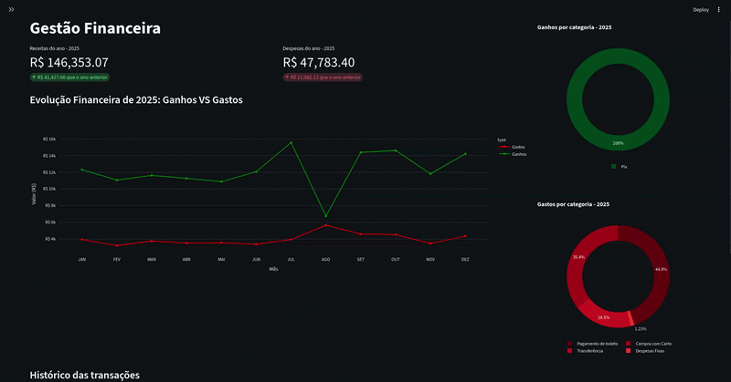

# FluxoSolo

**FluxoSolo** é um pipeline ETL (Extract, Transform, Load) e dashboard financeiro, que nasceu de uma dor que meu pai tinha como trabalhador autonomo de não conseguir dedicar um tempo para gerenciar suas finanças.

Pensando nisso, comecei este projeto para facilitar a vida dele. O FluxoSolo automatixa a ingestão de (PDF/CSV), aplicando regras de normalização e persistência em um banco de dados relacional para análise historica e vizualização de fluxo de caixa.

---

## Tecnologias Utilizadas

* **Linguagem:** Python 3.12+
* **Gestão de Dependências:** Poetry
* **Processamento de Dados:** Pandas, pdfplumber
* **Banco de Dados:** SQLAlchemy, SQLite, pydantic, alembic
* **Interface e Visualização:** Streamlit, Plotly
* **Qualidade de Código:** Ruff (Linter/Formatter), Taskipy

## Pré-requisitos

* Python >= 3.14
* Poetry

## Como Executar

### 1. Clone o repositório

```bash
    git clone https://github.com/seu-usuario/fluxosolo.git
    cd fluxosolo
```

### 2. Instale as dependências

```bash
    poetry install
```

### 3. Execute a aplicação streamlit

```bash
    poetry run task dashboard
```

### 4. Execute a API de auhtenticação de usuario

```bash
    poetry run task run
```

## Como acessar a aplicação

### 1. Acesasr a aplicação streamlit

[http://localhost:8501]( http://localhost:8501)

### 2. Acessar a documentação da API

**Documentação:**
[http://localhost:8000/redoc]( http://localhost:8000/redoc)

**Documentação Interativa (swagger):**
[http://localhost:8000/docs]( http://localhost:8000/docs)

## Estrutura do Projeto

```bash
├── fluxosolo/
│   ├── core/         # Configurações de engine, modelos e sessões de banco
│   ├── data/         # Extratos gerados para teste da aplicação
│   ├── models/       # Criação da tabela do banco de dados
│   ├── routers/      # Endpoints FastAPI
│   │   ├── users.py        # CRUD de usuários e autenticação
│   │   └── transactions.py # Endpoints de transações e upload de extratos
│   ├── schemas.py    # Schemas Pydantic (request/response models)
│   ├── services/     # Lógica de negócio: Parsers (Abstract Classes) e pipeline ETL
│   ├── views/        # Frontend Streamlit e componentes de visualização
│   └── app.py        # Ponto de entrada da aplicação
├── tests/            # Testes unitários focados na lógica de limpeza de dados
├── migrations/       # Migração de banco de dados via alembic
└── pyproject.toml
```

## Como Usar

A aplicação tem apenas uma tela com uma barra lateral, onde é possivel subir os extratos bancarios, e apos subir extratos na mesma barra lateral é possivel filtrar os dados para os graficos, que ficam na tela principal.



## Funcionalidades Principais

Este projeto esta em desenvolvimento ativo.

* [x] **Ingestão Multi-formato:** Suporte a extratos em PDF (via `pdfplumber`) e CSV.
* [x] **ETL Automático:** Normalização de datas e valores para um formato padrão de banco de dados.
* [x] **Dashboard Interativo:** Visualização dinâmica de Receitas vs. Despesas e categorização de fluxo com **Plotly** e **Streamlit**.
* [x] **Validação de Dados:** Interface que apresenta um *preview* dos dados limpos antes da persistência final no banco.
* [x] Normalização para 3NF: Reestruturação do esquema SQL para garantir integridade referencial e eficiência.
* [x] Autorização e Authenticação de usuário com **FastAPI**
* [ ] Testes automatizados com **Pytest**
* [ ] PostgreSQL + Docker + Deploy
* [ ] Consolidação de Cartão de Crédito: Lógica de merge para evitar dupla contagem entre pagamento de fatura e transações individuais.
* [ ] Expansão da Biblioteca de Parsers: Implementação de conectores para Inter, Santander e Itaú.
* [ ] Criar mais métricas e gráficos no Dashboard.
* [ ] Ciência de dados

## Decisões Técnicas

O diferencial técnico deste projeto reside na sua **escalabilidade e aplicação de padrões de projeto**:

* **Abstração de Parsers:** Utilização de **Classes Abstratas (ABC)** para definir o contrato de extração. Isso permite que novos bancos (Sicoob, NuBank, BB) sejam adicionados apenas implementando métodos específicos, mantendo o núcleo da aplicação (Core) intacto.
* **Resiliência de Ingestão:** Lógica avançada para lidar com variações de *encoding* (UTF-8 e Latin-1) e caracteres invisíveis de sistema (BOM), garantindo a leitura correta de extratos de bancos tradicionais e fintechs.
* **Camada de Persistência:** Implementação de um ORM com **SQLAlchemy** para garantir a integridade referencial e facilitar futuras migrações de banco de dados (ex: SQLite para PostgreSQL).
* **Data Cleaning:** Pipeline com Pandas para limpeza de caracteres especiais, conversão de tipos (casting) e padronização de sinais monetários para análise estatística.
